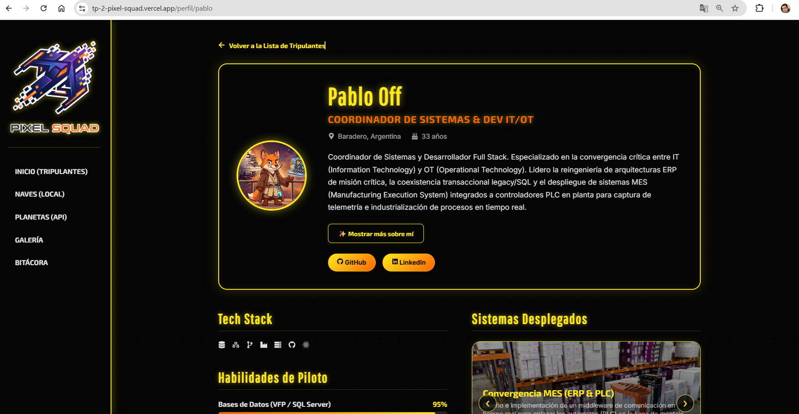
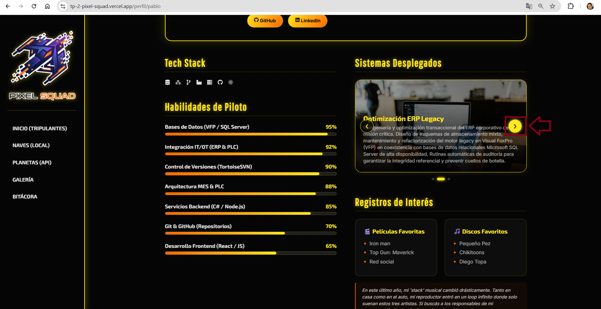
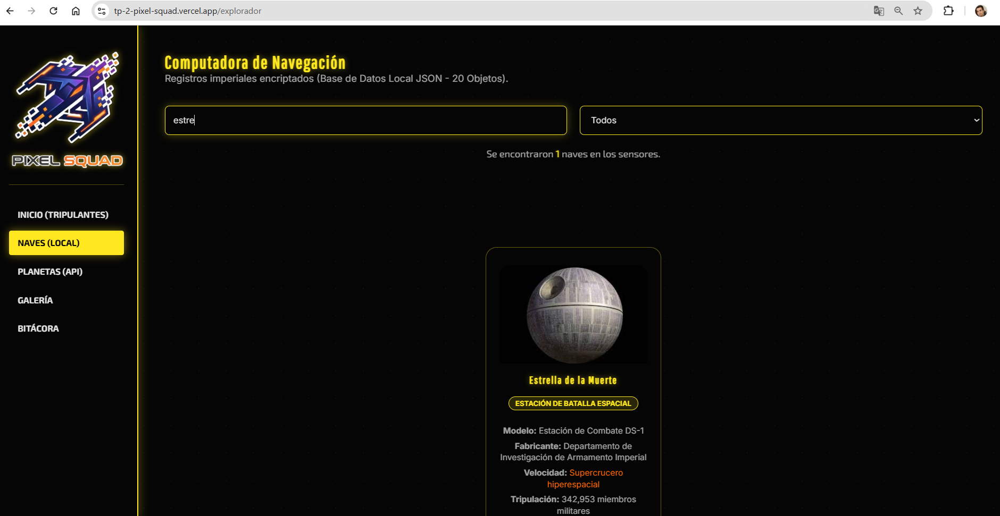
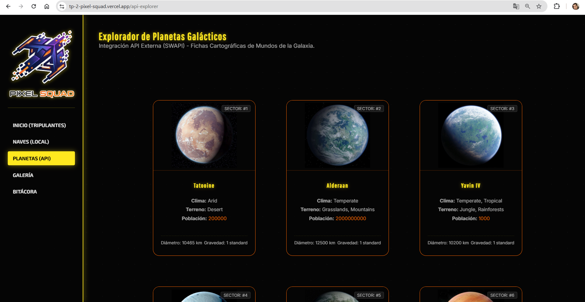
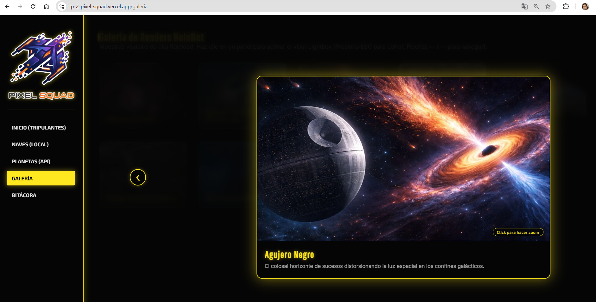

# TP2 - React en Equipo | PixelSquad

**Enlace al Proyecto Desplegado:** [tp-2-pixel-squad.vercel.app](https://tp-2-pixel-squad.vercel.app/)

---

## 1. Descripción del Proyecto
Este proyecto es una Single Page Application (SPA) desarrollada en React que funciona como el nodo principal de presentación de nuestro equipo, PixelSquad. El objetivo de este Trabajo Práctico 2 fue evolucionar nuestra web estática anterior hacia una arquitectura basada en componentes, gestionando rutas dinámicas, estados (Hooks) y consumo asíncrono de APIs y datos locales, todo bajo una estética inmersiva de ciencia ficción.

---

## 2. Integrantes del Equipo
* **Enzo Giangreco** - Full Stack Developer / Frontend & UI/UX | [Perfil de GitHub](https://github.com/enluuca)
* **Pablo Off** - Backend & Database Developer | [Perfil de GitHub](https://github.com/Poff93)
* **Alejandro Ramos** - Java Developer Trainee | [Perfil de GitHub](https://github.com/AleR25)
* **Ivan Faigenbom** - UX/UI & Python Developer | [Perfil de GitHub](https://github.com/ii-v-vi)

---

## 3. Tecnologías Utilizadas
* **Core:** React 19, Vite, JavaScript (ES6+), HTML5, CSS3.
* **Enrutamiento:** React Router DOM.
* **Iconografía:** `react-icons` (FontAwesome y SimpleIcons).
* **Control de Versiones:** Git y GitHub (Flujo de trabajo mediante ramas).
* **Despliegue:** Vercel.

---

## 4. Estructura de Archivos
El proyecto sigue una arquitectura modular para separar responsabilidades:

```text
src/
 ├── assets/      # Recursos estáticos globales.
 ├── components/  # Componentes modulares (Sidebar, ProgressBar, ProjectCarousel).
 ├── data/        # JSON locales (starships.json, team.json).
 ├── pages/       # Vistas renderizadas por React Router (Dashboard, Profile, JsonExplorer, ApiExplorer, Gallery, Logbook).
 ├── App.jsx      # Configuración de rutas y layout principal.
 ├── index.css    # Variables CSS y estilos globales neón.
 └── main.jsx     # Punto de entrada de la aplicación.
public/
 └── img/         # Imágenes estáticas locales para naves y galería.
```

---

## 5. Guía de Estilos
Aplicamos un diseño temático estilo "Archivo Galáctico", inspirado en interfaces Sci-Fi y Star Wars.

* **Paleta de Colores:**
  * Fondo Principal: `#050505` (Negro profundo)
  * Texto Principal: `#ffffff` (Blanco con opacidad)
  * Acento Principal (Láser/Bordes): `#ffe81f` (Amarillo Star Wars)
  * Acento Secundario (Hover/Brillos): `#ff6600` (Naranja intenso neón)
* **Tipografías:** (Importadas vía Google Fonts)
  * *Pathway Gothic One:* Títulos principales.
  * *Inter:* Textos descriptivos y lectura.
  * *Exo 2:* Navegación y Badges.
* **Efectos:** Uso intensivo de `box-shadow` para simular resplanderes neón y transiciones fluidas de `transform: scale()`.

---

## 6. Funciones Dinámicas (JavaScript / React)
Implementamos lógica avanzada en nuestros componentes utilizando los Hooks de React:
* **`useParams`:** Utilizado en `Profile.jsx` para capturar el ID de la URL y renderizar de forma dinámica la tarjeta del tripulante exacto consumiendo el JSON local.
* **`useState`:** Fundamental para el control de índices cíclicos en el `ProjectCarousel.jsx` y para el filtrado en tiempo real en `JsonExplorer.jsx`.
* **`useEffect` + `fetch`:** Implementado en `ApiExplorer.jsx` para consumir la API pública de SWAPI (Planetas), gestionando los estados de loading, error y data con botones de paginación controlados.
* **Event Listeners:** En `Gallery.jsx`, usamos `useEffect` para escuchar la tecla "Escape" y cerrar el Lightbox, limpiando el evento al desmontar el componente para evitar fugas de memoria.

### Capturas de Pantalla de la Plataforma
Para ilustrar las funciones dinámicas del sistema, se capturaron las siguientes secciones del Panel de Comando (ubicadas en la carpeta [screenshots/](screenshots)):

1. **Rutas Dinámicas (`useParams`)**  
   
   
2. **Carrusel de Proyectos de Tripulantes (`useState`)**  
   
   
3. **Buscador de Naves en Tiempo Real (`.filter()`)**  
   
   
4. **Consumo e Integración de SWAPI (`fetch`)**  
   
   
5. **Galería Modal con Listener de Teclado (`Escape`)**  
   

---

## 7. Evolución del Proyecto (De TP1 a TP2)
El paso de HTML/CSS estático a una SPA con React fue un salto arquitectónico:
* **Componentización:** Eliminamos la redundancia de código HTML creando componentes reutilizables (Ej: una sola vista `Profile.jsx` reemplaza múltiples archivos HTML estáticos).
* **Enrutamiento:** Reemplazamos los enlaces estáticos tradicionales por React Router, logrando una navegación instantánea sin recargas de página.
* **Manejo de Datos:** Migramos la información hardcodeada a estructuras de datos JSON y a consumos asíncronos de APIs externas, haciendo la web 100% escalable.

---

## 8. Uso de Inteligencia Artificial
Se integró la Inteligencia Artificial como asistente de desarrollo y auditoría UX, manteniendo el equipo la toma de decisiones arquitectónicas:
* **Modelos Utilizados:** Gemini 1.5 y ChatGPT (GPT-4o / Asistentes personalizados).
* **Generación de Contenido e Imágenes:** Los avatares originales fueron reemplazados por renders 3D generados con IA mediante prompts temáticos Sci-Fi. Los mocks de datos de naves espaciales (JSON) fueron enriquecidos con ayuda de IA.
* **Auditoría de Código y UX (Debugging):** Utilizamos IA para realizar auditorías estáticas del código, lo que nos ayudó a refactorizar el escuchador de eventos del teclado en el Lightbox, optimizar las dependencias de los `useEffect` para prevenir bucles infinitos, y estructurar el sistema offline de imágenes de planetas con lógica cíclica y de fallbacks.